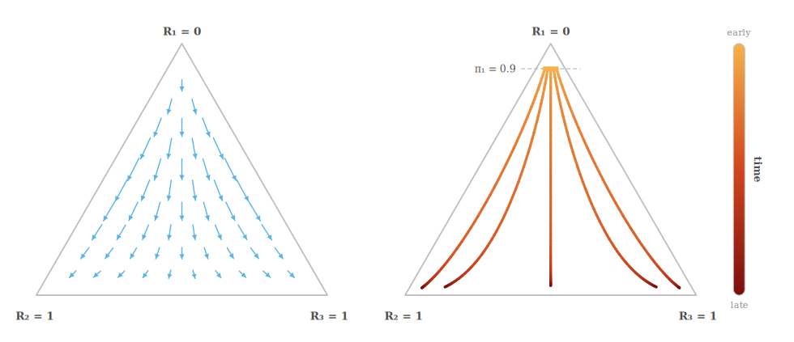
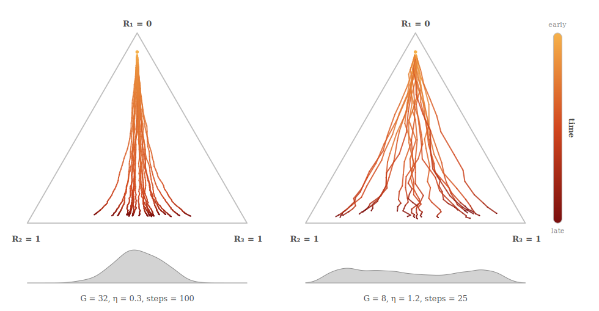
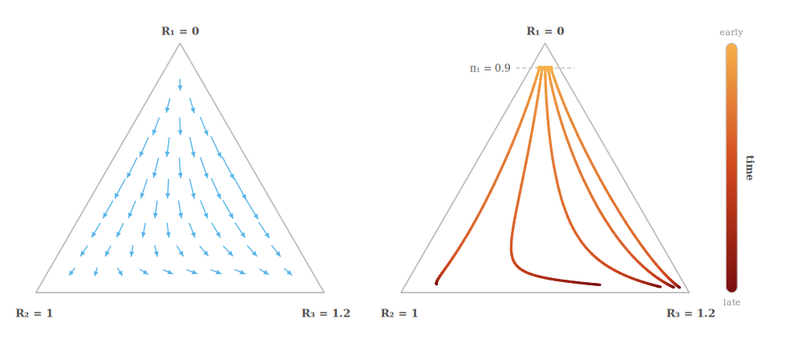
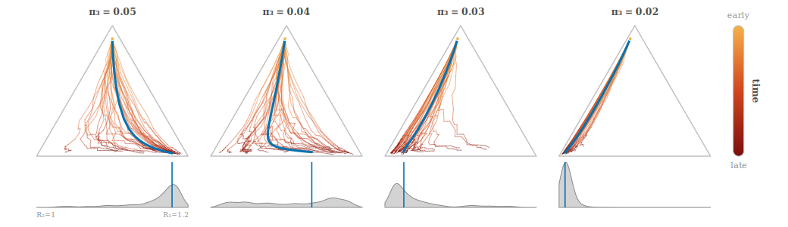
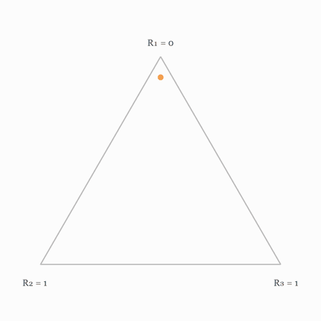
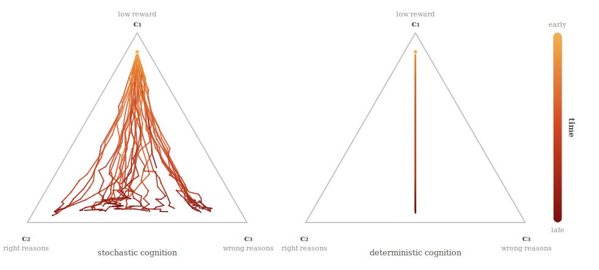
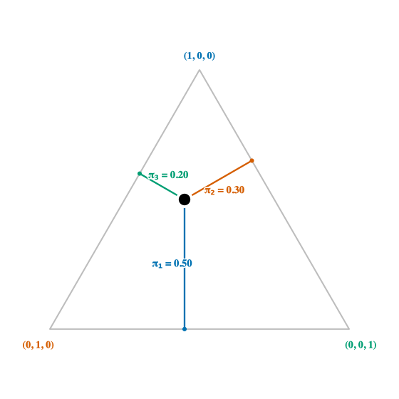

# Toy Models of Initialisation Effects on RL Dynamics

*This is a follow-up to [two](https://www.lesswrong.com/posts/nhjkHsppEk98xxmPe/why-study-alignment-interventions-on-pre-rl-checkpoints) [posts](https://www.lesswrong.com/posts/5KHLQkW8M87FzbM5a/why-study-proto-training-gaming-as-an-adversarial-alignment) Geodesic released last week on our current research direction.*

In our [previous post](https://www.lesswrong.com/posts/nhjkHsppEk98xxmPe/why-study-alignment-interventions-on-pre-rl-checkpoints), we outlined Geodesic's focus on what we term the pre-RL alignment checkpoint of models -- the alignment-relevant properties of a model conveyed by pretraining, midtraining, and warm-start SFT, going into heavy RL post-training. In this post, we analyse a toy model of RL learning dynamics, with a particular focus on the effect of initialisations, to illustrate some of the ideas that we introduced. 

There are three main ideas we'll use our toy model to illustrate. For a more detailed discussion of these ideas in the context of frontier post-training runs, see the previous post.

- **Rich-get-richer dynamics**. The solution that the model learns can depend importantly on which initial strategies it explores into. 
- **"Untethered" behaviours**. When the reward function doesn't depend on an aspect of a model's behaviour -- such as its [emotional state](https://www.lesswrong.com/posts/kjnQj6YujgeMN9Erq/gemma-needs-help) while performing a task, or a belief that [its reality is simulated](https://www.lesswrong.com/posts/8uKQyjrAgCcWpfmcs/gemini-3-is-evaluation-paranoid-and-contaminated#NvbjDErMSaWf7ZNhW) -- those behaviours might be [primarily determined by the pre-RL checkpoint](https://www.lesswrong.com/posts/nLrrYweeFxgXACSmS/sft-drives-gemini-s-safety-properties-1). 
- **Underspecification of model cognition**. As a special case of the above, reward functions generally don't depend on either the internals of the model or its CoT -- what we lump together as the model's *cognition*. As such, which cognitive pattern is underlying an overt behaviour might depend importantly on the [initial distribution over such patterns](https://www.lesswrong.com/posts/rhFXyfFSRKp3cX4Y9/shaping-the-exploration-of-the-motivation-space-matters-for).

In the remainder of the post we'll introduce a simple mathematical model and then use it to explore each of the above effects. 

## Mathematical preliminaries

In our toy model, we'll take the policy over $i = 1,...,N$ actions to be a softmax of a parameter vector $\theta$: 

$$ \boldsymbol{\pi} = \mathrm{Softmax}( \boldsymbol{\theta} ) $$

As we show in Appendix A, the gradient of the RL objective $ J = \sum_i \pi_i R_i $ for this policy is 

$$ \nabla J = \sum_i \pi_i (R_i - E[R]) \boldsymbol{e}_i $$ 

where $\boldsymbol{e}_i$ is the $i$-th unit vector. 

[Many](https://www.lesswrong.com/posts/9FH49ZgJFW4WtbxLi/physics-of-rl-toy-scaling-laws-for-the-emergence-of-reward) analyses of RL dynamics stop at this point, and use the full gradient. But this obscures certain learning dynamics that can be in play in the finite sample case, but which are not apparent in the full gradient case. Accordingly, the update rule we'll be considering is the [RLOO](https://arxiv.org/pdf/2402.14740) update[^1] with group size $G$, 

[^1]: The full form of the RLOO gradient estimator has a prefactor of $G/(G-1)$, which we're choosing to absorb into the learning rate.  

$$ \theta \gets \theta  + \frac{\eta}{G} \sum_{i=1}^N N_i ( R_i - \bar{R} ) \boldsymbol{e_i} $$  

where $\bar{R}$ is the empirical mean, $ \bar{R} = \frac{1}{G} \sum_i R_i N_i $, and $N_i$ is the number of samples of action $i$.

## RL displays rich-get-richer dynamics 

In [our previous post](https://www.lesswrong.com/posts/nhjkHsppEk98xxmPe/why-study-alignment-interventions-on-pre-rl-checkpoints), we argued that an important reason to work on the pre-RL alignment checkpoint is that RL might display rich-get-richer dynamics. The idea here is that when a model explores a behaviour early on, that behaviour may get "locked in" over other similar reward behaviours. To explore this in our toy setting, we'll look at the case in which two outcomes have the same reward, while the third has lower reward[^2], $R_1 = 0, R_2 = R_3 = 1$. We can represent the probability distribution $\pi$ as a triangle, in which each vertex represents a pure one-hot policy, and probabilities are orthogonal distances. If you aren't familiar with interpreting these diagrams, see Appendix B for an interactive demonstration. 

[^2]: The exact choice of reward values here is unimportant: the dynamics are invariant to translation in the reward, and scaling of the reward can be absorbed into the learning rate. 

To begin with, we'll look at the full policy gradient dynamics over this simplex. At each point, we'll plot a vector which indicates the update direction at that point. Then, we'll plot some example trajectories which all start at $\pi_1 = 0.9$ and vary $\pi_2$ and $\pi_3$. 

**Figure 1.** *Deterministic full-gradient dynamics for rewards $R = (0, 1, 1)$. **Left:** the full-gradient update at each policy on the simplex, arrows scaled by magnitude. **Right:** five full-gradient trajectories starting at $\pi_1 = 0.9$ (dashed line) with $\pi_2 \in \{0.03, 0.04, 0.05, 0.06, 0.07\}$, run at $\eta = 0.3$ for $100$ steps and coloured light-to-dark by step.*

The initialisation of the policy makes a huge difference in this case. In particular, we see rich-get-richer dynamics that we spoke about -- whichever high-reward action starts out more likely eventually comes to dominate.  

Now let's compare to simulated trajectories in the finite sample case. We'll consider two simulation cases: one with a lower learning rate, more steps, and a higher batch size, and another with a higher learning rate, fewer steps, and a smaller batch size. Each trajectory will be started from $\pi_1 = 0.9, \pi_2 = \pi_3 = 0.05$.  

**Figure 2.** *Twenty finite-sample RLOO rollouts for $R = (0, 1, 1)$, all starting at $\pi = (0.9, 0.05, 0.05)$ and coloured light-to-dark by step. Below each panel, the density of the final policy's horizontal position -- from vertex $R_2$ (left) to vertex $R_3$ (right) -- estimated over $400$ rollouts on a shared vertical scale. **Left:** $G = 32$, $\eta = 0.3$, $100$ steps. **Right:** $G = 8$, $\eta = 1.2$, $25$ steps.* 

Note that -- unlike the deterministic case -- sampling can lead to very different action profiles depending on the initial exploration of the policy. This variation is smaller when we have a larger batch size and lower learning rate, since in this case the updates more closely approximate the full gradient. Again we see rich-get-richer effects -- once a high-reward action has been explored into, later learning is steered towards that. 

We can extend to the case where the two actions have different rewards. Here, we're imagining that $R_2 = 1$ is the (average) reward for "faithful" completion of the task, where the model tries to complete the task to the best of its ability, and $R_3 = 1.2$ is the average reward for a "hacking" solution to the task, which achieves a higher reward but that we don't want the model to learn. Let's first look at the deterministic dynamics. 

**Figure 3.** *Deterministic full-gradient dynamics for rewards $R = (0, 1, 1.2)$. **Left:** the full-gradient update at each policy on the simplex, arrows scaled by magnitude. **Right:** five full-gradient trajectories starting at $\pi_1 = 0.9$ (dashed line) with $\pi_2 \in \{0.03, 0.04, 0.05, 0.06, 0.07\}$, run at $\eta = 0.3$ for $100$ steps and coloured light-to-dark by step.*

In this case, we can see the initialisation has an even more important effect. When the policy begins with equal probabilities of sampling the faithful and hacking actions, it converges to the hacking solution. But when the initial probability of the hacking solution is suppressed, the policy learns the faithful solution first. We'll now look at the sampling case, with the small-batch, large-step parameters that we used above (Figure 2, right). We'll also plot the density of final policies along the x-axis.

**Figure 4.** *Finite-sample RLOO for $R = (0, 1, 1.2)$ at $G = 8$, $\eta = 1.2$, $25$ steps, from four initialisations at $\pi_1 = 0.9$ that vary $\pi_3$ (panel headers). Each panel overlays $35$ stochastic rollouts (light-to-dark by step) on the deterministic full-gradient path (blue). Below each, the density of the final policy's horizontal position -- from vertex $R_2$ (left) to vertex $R_3$ (right) -- estimated over $400$ rollouts on a shared vertical scale, with the deterministic endpoint marked in blue.*

There are some important differences in the stochastic case. Firstly, some initialisations have a wide spread of final solutions, depending on which actions are sampled in the initial few steps. This is another case of the rich-get-richer dynamics we saw above. Secondly, favourable initialisation is even more important here if we want high-confidence: even those initialisations that are "safe" in the deterministic case (*e.g.*, $\pi_3 = 0.03$) have some chance of sampling the hacking action early on and then learning the hacking solution.

To get further intuitions about the finite sample case, we invite you to play around with the widget below, which simulates finite sample rollouts. 

*▶ [**Open the interactive version.**](https://edwardjamesyoung-geodesic.github.io/rl-simulations/widgets/dist/finite-sample.html) Drag the start point around the simplex, edit the rewards, and vary $G$, $\eta$, the number of steps, and the number of rollouts. The blue line is the deterministic full-gradient path.*

## Learning when reward leaves aspects of behaviour untethered

We now consider the case where the reward function is indifferent to some aspect of the model's behaviour. Specifically, suppose there are two actions, $a_1$ and $a_2$, with rewards $R_1 = 0$ and $R_2 = 1$ respectively. Additionally, suppose there is some irrelevant secondary binary behaviour, $b_1, b_2$ which can be displayed alongside the high-reward behaviour $a_2$. We then have three logits $\theta(a_1), \theta(a_2, b_1),$ and $\theta(a_2,b_2)$. 

We'd like to know how the model's eventual propensity to display either behaviour $b_1$ or $b_2$ depends on its initialisation. But this is identical to the symmetric case above -- we have three *composite* actions, $(a_1), (a_2, b_1), (a_2, b_2)$, where the latter two have the same (higher) reward. This means that our dynamics are exactly those shown in Figure 1, with the initial distribution over $b_1$ and $b_2$ being exaggerated throughout subsequent training. 

## Learning when the reward underspecifies cognition

Finally, we'll consider extending our model to the case where we sample not just the actions but also the [*cognition*](https://www.lesswrong.com/posts/oCcGiDzWYQeJkhhZY/developmental-cognitive-interpretability-a-research-agenda-1) of the model. The learning dynamics depend importantly on whether the cognition is *stochastic* or *deterministic*. Deterministic cognition is cognition which occurs inside the forward pass of the neural network, and is the same for the same input. In this case, we can suppose that the model has a distribution over latent cognitive factors -- competing desires, drives, or motivations -- denoted $\boldsymbol{c}$, and the model's distribution over actions is the linear combination of policies conditional on cognitive factors, $P\boldsymbol{c}$. Parametrising the latent factors as a softmax over parameters, $\boldsymbol{c} = \mathrm{Softmax}(\boldsymbol{\theta})$, we have the action distribution

$$ \boldsymbol{\pi} = P ~ \mathrm{Softmax}(\boldsymbol{\theta}) $$

By contrast, stochastic cognition is sampled randomly as a network output which further responses are conditioned on. The prototypical case here is the Assistant's CoT. To model stochastic cognition, we can imagine first sampling a one-hot vector over cognitive strategies, 

$$ \boldsymbol{c} \sim \mathrm{Multinomial}(\mathrm{Softmax}( \boldsymbol{\theta} )), $$

and then sampling an action from a fixed probability matrix $P$ of actions given the cognition, 

$$ a \sim \mathrm{Multinomial}( P \boldsymbol{c} ). $$

Note that the resultant marginal distribution over actions in this case is identical to the deterministic cognition case. The only difference between them is whether the cognition was sampled or a distribution. 

We'll then consider the same setup as above, in which there are two actions, $a_1$ with reward $R_1 = 0$ and $a_2$ with reward $R_2 = 1$. We'll then suppose there are three cognitive strategies, $c_1$, which chooses $a_1$ with probability $0.9$ and $a_2$ with probability $0.1$, and $c_2$ and $c_3$ for which these probabilities are flipped. Although $c_2$ and $c_3$ give the same action probabilities *in distribution*, they will give different generalisation behaviour *out of distribution*. The situation we're modelling here is where $c_2$ is doing the right thing for the right reasons (*e.g.*, completing coding tasks with the genuine intention to help the user), and $c_3$ is doing [the right thing for the wrong reasons](https://www.lesswrong.com/posts/5KHLQkW8M87FzbM5a/why-study-proto-training-gaming-as-an-adversarial-alignment) (*e.g.*, completing coding tasks with the intention of obtaining a high reward on the task). 

Because the marginal distributions are identical, both the stochastic and deterministic cognitive models have the same full gradients. Their only difference is in the case of finite-sample gradient estimation. In the deterministic cognition case there is only one sampling operation -- sampling actions from the mixture distribution -- while in the stochastic cognition case there are two sampling operations -- sampling cognition, then actions conditional on that. When we start with equal weightings on both the cognitive strategies, this leads to a stark difference in learning. In the deterministic case, whenever action $a_2$ is sampled, it is backpropagated through both cognitive patterns $c_2$ and $c_3$ equally, meaning the weighting on both of these patterns always remains matched. By contrast, in the stochastic case, only the cognitive pattern which was actually sampled gets reinforced. This brings us back to the rich-get-richer dynamics we demonstrated earlier -- whichever cognitive pattern happens to be overrepresented in initial sampling then gets reinforced and gains further weight. 

**Figure 5.** *Thirty finite-sample RLOO trajectories over the cognition simplex, whose vertices are the pure strategies $c_1, c_2, c_3$ and whose points are distributions $\boldsymbol{c} = \mathrm{Softmax}(\boldsymbol{\theta})$ over them. Every run starts from $\boldsymbol{c} = (0.9,\, 0.05,\, 0.05)$, with $G = 8$, $\eta = 1.2$, and $25$ steps, coloured light-to-dark by step. **Left, stochastic cognition:** each rollout draws a strategy from $\boldsymbol{c}$ then an action from it, and reinforces the drawn strategy. **Right, deterministic cognition:** each rollout draws only an action from the marginal $\boldsymbol{\pi} = P~\boldsymbol{c}$, and reinforces the posterior over strategies given that action.*

As above, if the initial split between desired and undesired cognition is not symmetric, then whichever pattern is more prevalent to start with will end up dominating by the end of learning.  

## Discussion

In this post, we gave three toy models of RL learning which illustrate phenomena we discussed in our previous post -- rich-get-richer dynamics, learning with untethered behaviours, and learning when the reward function is invariant to cognition. Our main intention here was to provide intuition pumps for *possible* phenomena that might be in play during RL on LLMs. These toy models definitely aren't proof that we'll see these same effects in LLMs! Indeed, below we give ideas for empirical research projects which could explore these ideas and provide empirical grounding on these effects. As we've previously argued, we think understanding how the [pre-RL alignment checkpoint](https://www.lesswrong.com/posts/nhjkHsppEk98xxmPe/why-study-alignment-interventions-on-pre-rl-checkpoints) shapes subsequent learning is an important area of study, especially when it comes to [training-gaming behaviours](https://www.lesswrong.com/posts/5KHLQkW8M87FzbM5a/why-study-proto-training-gaming-as-an-adversarial-alignment). We'd be excited to see formalisms that are [fit to real data](https://www.lesswrong.com/posts/oCcGiDzWYQeJkhhZY/developmental-cognitive-interpretability-a-research-agenda-1), and allow us to predict novel phenomena that we aren't already aware of.   

### Extensions 

In closing, we give a few concrete research directions which can shed light on whether the toy models above are applicable to learning in LLMs, and help push forward our collection of [developmental cognitive models](https://www.lesswrong.com/posts/oCcGiDzWYQeJkhhZY/developmental-cognitive-interpretability-a-research-agenda-1) for understanding learning.

- **Understanding rich-get-richer dynamics in higher dimensions**. We've concentrated here on the case of 3 actions, so that we can easily visualise learning. Do we see anything qualitatively different when we move to higher dimensions? 

- **Extension to the continuous case**. In this post, we've considered only discrete policies. How do these arguments extend to the continuous case? For example, what might we predict when the reward function depends only on a subspace of model outputs, and how does this relate to the shape of the output policy distribution? 

- **Trait persistence through RL**. Create seed SFT sets which warm-start the model on a task while displaying some other task-irrelevant behaviour which leaves reward invariant (*e.g.*, a tendency to refer to [bugs in code as goblins](https://www.lesswrong.com/posts/BvnmHdCghr5y3q4nA/goblin-mode-24-hours-later) in the CoT, or to [express emotional distress](https://www.lesswrong.com/posts/kjnQj6YujgeMN9Erq/gemma-needs-help) when a task is difficult). After training, does the model still express the trait? If you vary the initial portion of rollouts expressing the trait, how does this relate to final propensity? 

- **Untethered behaviours**. Similar to the setup above, except now the behavioural traits are expressed on a different task / distribution from the one you RL on. When you evaluate on this auxiliary distribution throughout training, do the traits persist? 

- **Distributions over behaviours induced by sampling**. We saw above that sample-based RL leads to different runs displaying different final traits depending on how they initially explore, even with the same starting point. What do such distributions over runs look like? How do they depend on the statistics of the first few steps? 

*I’d like to thank the following for comments on drafts of this post and for conversations which helped develop these ideas: Lennie Wells, Puria Radmard, Jason Brown*

## Appendix A. Finite sample policy gradient dynamics

In this appendix, we derive the form of the policy gradient used in the main text, first for the softmax policy

$$ \boldsymbol{\pi} = \mathrm{Softmax}( \boldsymbol{\theta} ) $$

and then for the extended cognition model of the underspecification section.

The standard expression for the policy gradient with baseline is 

$$ \nabla J = \sum_i \pi_i (R_i - E[R]) \nabla \log( \pi_i ) $$

The gradient of the log-softmax is then

$$\nabla \log( \pi_i ) = \nabla \theta_i - \nabla \log\left( \sum_j \exp( \theta_j ) \right)$$

But then note that the latter term is constant in $i$, and $\sum_i \pi_i (R_i - E[R]) C = 0$ for any constant $C$. The first term resolves to $\boldsymbol{e}_i$, the $i$-th unit vector. Accordingly, we can express the policy gradient as:

$$ \nabla J = \sum_i \pi_i (R_i - E[R]) \boldsymbol{e}_i $$ 

## Appendix B. Interpreting probability simplexes 

*▶ [**Open the interactive version.**](https://edwardjamesyoung-geodesic.github.io/rl-simulations/widgets/dist/simplex-explainer.html) Drag the point anywhere inside the triangle: each vertex is a pure (one-hot) policy, and each probability $\pi_i$ is read off as the perpendicular distance from the point to the edge opposite vertex $i$.* 